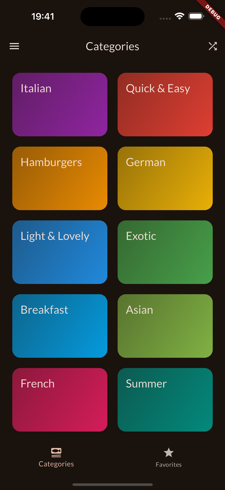
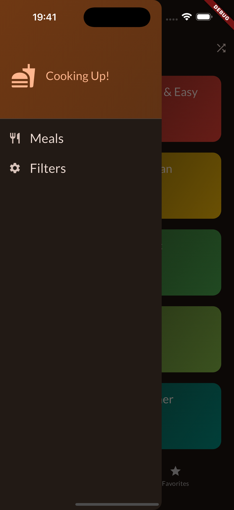
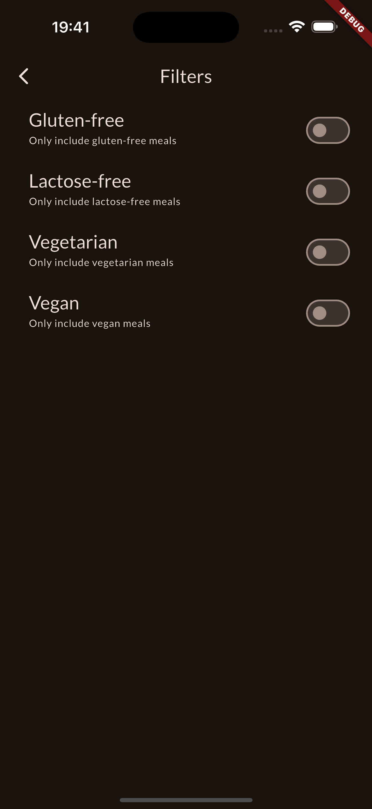
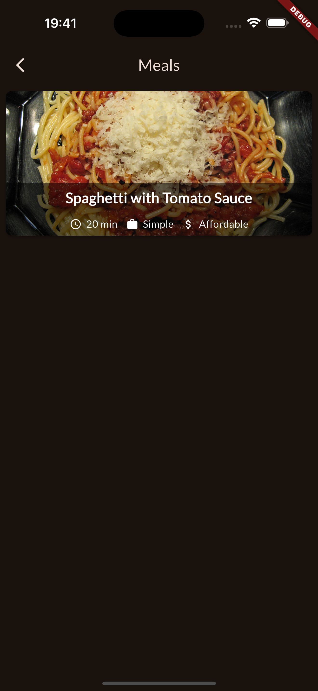
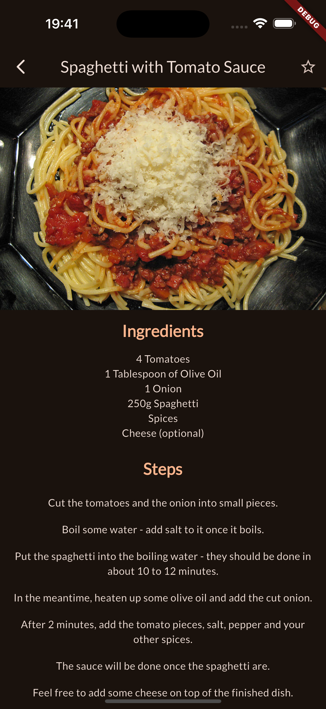
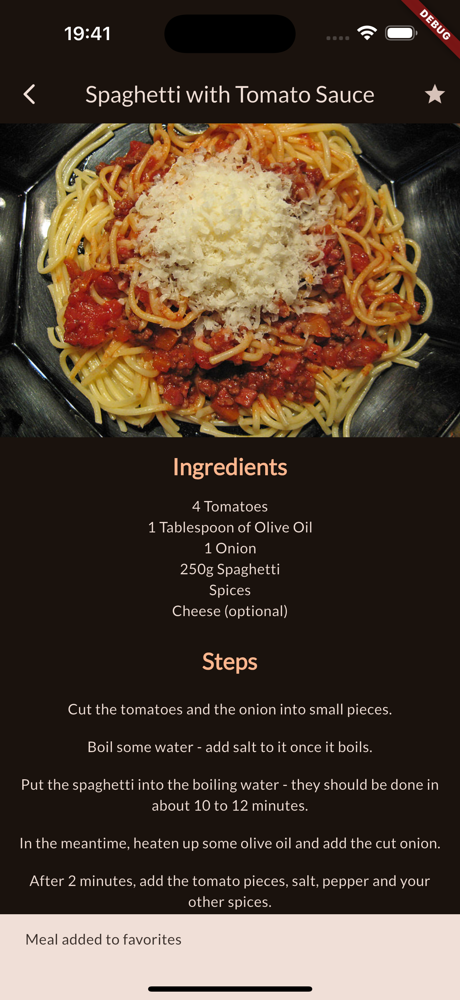
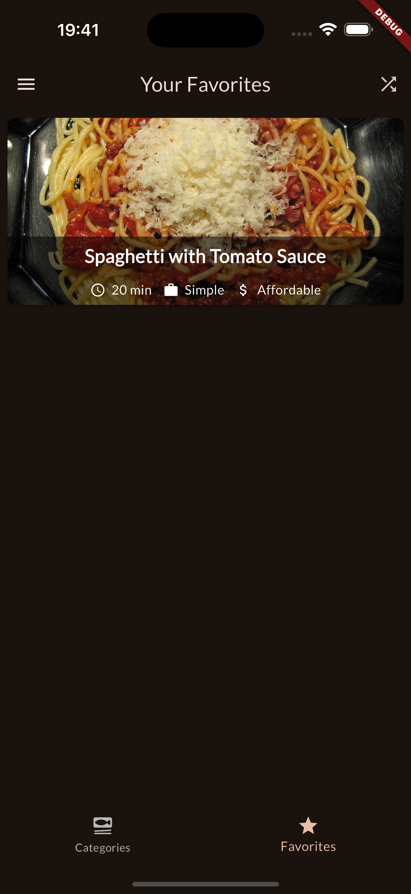

# meals_app

This project is a group assignment for NTNU course IDATA2503, where we are to build an Meals app for mobile. We will heavily follow a [udemy](https://www.udemy.com/course/learn-flutter-dart-to-build-ios-android-apps/?couponCode=24T4MT90924A) course and add our own features on top of that. In this case it will be a way to randomly select a meal, if you have a hard time choosing for yourself.

- [User Stories](#user-stories)
- [Class Diagram](#class-diagram)
- [Screenshots](#screenshots)
- [Video](#video)
- [Collabiration](#collabriation)

## User stories

User stories for our meals app.

| **User** | **Story**                                                                                                                                            |
| -------- | ---------------------------------------------------------------------------------------------------------------------------------------------------- |
| User 1   | As a user, I want to browse different categories of meals, so that I can easily find meals based on my preference.                                   |
| User 2   | As a user, I want to view detailed recipes and ingredient lists for each meal, so that I can follow the steps to prepare the dish at home.           |
| User 3   | As a user, I want to filter meals by dietary preferences like vegan, gluten-free, etc., so that I can quickly find meals that meet my dietary needs. |
| User 4   | As a user, I want to add meals to my favorites list, so that I can easily access my favorite meals later.                                            |
| User 5   | As a user, I want to see an image of each meal, so that I can visually evaluate whether I might want to try it.                                      |
| User 6   | As a user, I want to see preparation time, price, and difficulty level for each meal, so that I can decide if the recipe fits my schedule and skill. |
| User 7   | As a user, I want to be able to remove meals from my favorites list, so that I can keep it organized with only the meals I still enjoy.              |
| User 8   | As a user, I want to be able to randomly select a meal if I don’t know what I want.                                                                  |

## Class Diagram

```mermaid
classDiagram
class App
App : +build() Widget
StatelessWidget <|-- App

class Category
Category : +id String
Category : +title String
Category : +color Color
Category o-- Color

class Filter
<<enumeration>> Filter
Filter : +index int
Filter : +values$ List~Filter~
Filter : +glutenFree$ Filter
Filter o-- Filter
Filter : +lactoseFree$ Filter
Filter o-- Filter
Filter : +vegetarian$ Filter
Filter o-- Filter
Filter : +vegan$ Filter
Filter o-- Filter
Enum <|.. Filter

class Meal
Meal : +id String
Meal : +categories List~String~
Meal : +title String
Meal : +imageUrl String
Meal : +ingredients List~String~
Meal : +steps List~String~
Meal : +duration int
Meal : +complexity Complexity
Meal o-- Complexity
Meal : +affordability Affordability
Meal o-- Affordability
Meal : +isGlutenFree bool
Meal : +isLactoseFree bool
Meal : +isVegan bool
Meal : +isVegetarian bool

class Complexity
<<enumeration>> Complexity
Complexity : +index int
Complexity : +values$ List~Complexity~
Complexity : +simple$ Complexity
Complexity o-- Complexity
Complexity : +challenging$ Complexity
Complexity o-- Complexity
Complexity : +hard$ Complexity
Complexity o-- Complexity
Enum <|.. Complexity

class Affordability
<<enumeration>> Affordability
Affordability : +index int
Affordability : +values$ List~Affordability~
Affordability : +affordable$ Affordability
Affordability o-- Affordability
Affordability : +pricey$ Affordability
Affordability o-- Affordability
Affordability : +luxurious$ Affordability
Affordability o-- Affordability
Enum <|.. Affordability

class Screens
<<enumeration>> Screens
Screens : +index int
Screens : +values$ List~Screens~
Screens : +meals$ Screens
Screens o-- Screens
Screens : +filters$ Screens
Screens o-- Screens
Enum <|.. Screens

class FiltersScreen
FiltersScreen : +build() Widget
StatelessWidget <|-- FiltersScreen

class TabsScreen
TabsScreen : +createState() State<TabsScreen>
StatefulWidget <|-- TabsScreen

class _TabsScreenState
_TabsScreenState : -_selectedTab Tabs
_TabsScreenState o-- Tabs
_TabsScreenState : -_setTab() void
_TabsScreenState : -_setScreen() void
_TabsScreenState : -_openRandomMeal() void
_TabsScreenState : +build() Widget
State <|-- _TabsScreenState

class Tabs
<<enumeration>> Tabs
Tabs : +index int
Tabs : +values$ List~Tabs~
Tabs : +categories$ Tabs
Tabs o-- Tabs
Tabs : +favorites$ Tabs
Tabs o-- Tabs
Enum <|.. Tabs

class MealDetailsScreen
MealDetailsScreen : +meal Meal
MealDetailsScreen o-- Meal
MealDetailsScreen : -_toggleFavorite() void
MealDetailsScreen : +build() Widget
StatelessWidget <|-- MealDetailsScreen

class MealsScreen
MealsScreen : +title String?
MealsScreen : +meals List~Meal~
MealsScreen : +routeName$ String
MealsScreen : +onMealSelected() void
MealsScreen : +build() Widget
StatelessWidget <|-- MealsScreen

class CategoriesScreen
CategoriesScreen : -_selectCategory() void
CategoriesScreen : +build() Widget
StatelessWidget <|-- CategoriesScreen

class FavoritesState
FavoritesState : -_favoriteMeals List~Meal~
FavoritesState : +favoriteMeals List~Meal~
FavoritesState : +toggleFavorite() void
FavoritesState : +isFavorite() bool
FavoritesState : +clearFavorites() void
ChangeNotifier <|-- FavoritesState

class FiltersState
FiltersState : +filters Map~Filter, bool~
FiltersState : +selectedFilters Map~Filter, bool~
FiltersState : +glutenFree bool
FiltersState : +lactoseFree bool
FiltersState : +vegetarian bool
FiltersState : +vegan bool
FiltersState : +updateFilter() void
FiltersState : +resetFilters() void
ChangeNotifier <|-- FiltersState

class MealItemTrait
MealItemTrait : +icon IconData
MealItemTrait o-- IconData
MealItemTrait : +label String
MealItemTrait : +build() Widget
StatelessWidget <|-- MealItemTrait

class MealItem
MealItem : +meal Meal
MealItem o-- Meal
MealItem : +onMealSelected void FunctionMeal
MealItem o-- void FunctionMeal
MealItem : +complexityText String
MealItem : +affordabilityText String
MealItem : +build() Widget
StatelessWidget <|-- MealItem

class CategoryGridItem
CategoryGridItem : +category Category
CategoryGridItem o-- Category
CategoryGridItem : +onSelectCategory void Function
CategoryGridItem o-- void Function
CategoryGridItem : +build() Widget
StatelessWidget <|-- CategoryGridItem

class MainDrawer
MainDrawer : +onSelectScreen void FunctionScreens
MainDrawer o-- void FunctionScreens
MainDrawer : +build() Widget
StatelessWidget <|-- MainDrawer
```

## Screenshots

Images of finished app.

## Video

[App video](doc/Meals%20app%20video.mp4)

## Collabriation

Both Anders and Daniel finished the Udemy course separately.
We had a meeting over Discord to find extra features to be added, that was not to easy or obvious.
We agreed that the state handling that was added in the course was suboptimal so we decided to reimplement it with the provider package. By using provider we could have a central place for the states and then get/update this state from anywhere in the app.
We ended up with a way to randomly select a meal, if the user has a hard time choosing for themself, as the extra feature. The button to find the random meal is in the top right of the tabs screen.
When we were both happy with the app, we discussed what to write in our documentation, and then wrote it together while talking over discord.
